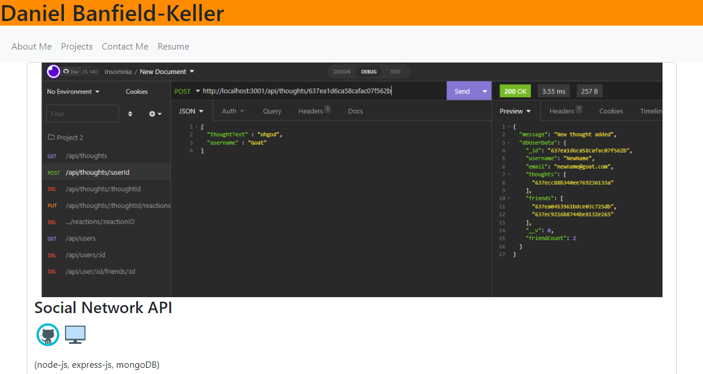

# React Portfolio

## Description
This project sets out to create a personal portfolio site using react. It features a fully functional web application that includes a short bio, recent projects, contact, and resume section. Formatting (WIP) is done using bootstrap. The application features a fully dynamically rendered interface that does not require page reloads. The formatting is somewhat basic as of now, but will be polished in the future. With additional refactoring and polish, this will be used as my primary portfolio site to show to prospective employers. 

The site is hosted at 

## Table of Contents
 - [Description](#description)
 - [Installation](#installation)
 - [Usage](#usage)
 - [License](#license)
 - [Contributing](#contributing)
 - [Tests](#tests)
 - [Questions](#questions)
 ## Installation

N/A
 
 ## Usage

Please visit the site at: 

It should appear as below

[]

## License
This application is not under any license.

## Contributing
Feel free to submit a pull request.

## Tests
N/A

## Questions
If you have any questions please feel free to reach out to me via email at DPAJBK@gmail.com